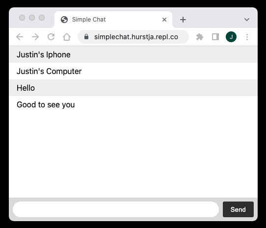

# SimpleChat- A chat app built with Socket.IO

This is a barebones chat application, built using boilerplate code from [Socket.IO](http://socket.io/get-started/chat/)

  

Follow these steps to run the project:
  - Open in Repl.it [here](https://replit.com/@hurstja/simplechat#index.js)
  - Fork Repl to your own account
  - In the forked version click on 'Shell' and type 'npm start' to start the server
    - The application won't work unless the server has been started
  - Previously hosted on Heroku, but they stopped offering free Dynos
